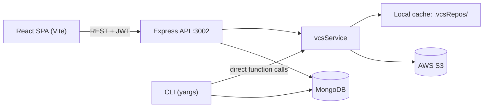
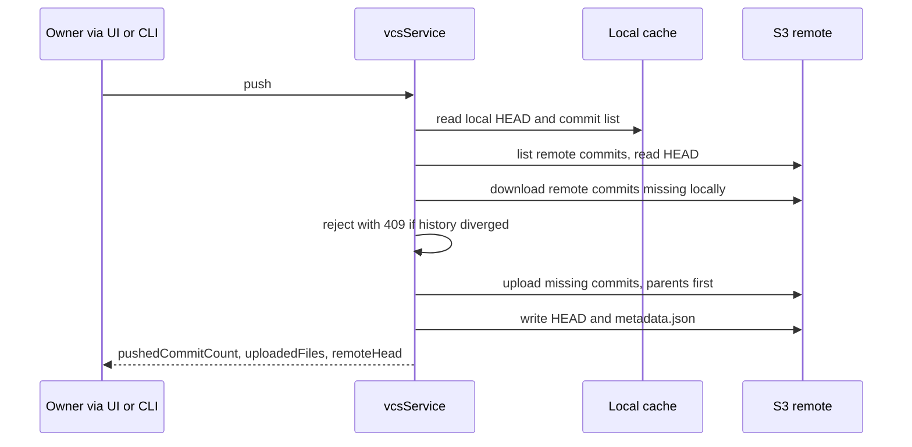

# Version Control System — Technical Documentation

This document describes the architecture, data model, REST API, version-control engine, CLI and frontend of the **Version Control System** project. For a quick start, see [README.md](./README.md).

## Table of contents

1. [Overview](#1-overview)
2. [Architecture](#2-architecture)
3. [Tech stack](#3-tech-stack)
4. [Project structure](#4-project-structure)
5. [Core concepts](#5-core-concepts)
6. [Storage layout and file formats](#6-storage-layout-and-file-formats)
7. [Data models](#7-data-models)
8. [Authentication and authorization](#8-authentication-and-authorization)
9. [REST API reference](#9-rest-api-reference)
10. [The VCS engine in detail](#10-the-vcs-engine-in-detail)
11. [CLI reference](#11-cli-reference)
12. [Frontend](#12-frontend)
13. [Configuration](#13-configuration)
14. [Setup, build and deployment](#14-setup-build-and-deployment)
15. [Testing](#15-testing)
16. [Error handling conventions](#16-error-handling-conventions)
17. [Known limitations and suggested improvements](#17-known-limitations-and-suggested-improvements)

---

## 1. Overview

The project is a Git-inspired version control platform made of three parts that share one backend codebase:

| Part         | Description                                                                                   |
| ------------ | --------------------------------------------------------------------------------------------- |
| **Web app**  | React single-page application for accounts, repositories, an in-browser editor, history, issues |
| **REST API** | Express server exposing users, repositories, issues, dashboard statistics and VCS operations   |
| **CLI**      | `node index.js <command>` — the same VCS operations from a terminal                            |

Design goals visible in the code:

- **One source of truth for history** — commit snapshots live in AWS S3 under `repositories/<repoId>/`. The web UI and the CLI use the same prefix, so work done in one is visible in the other after a push/pull.
- **Immutable, snapshot-based commits** — every commit is a full copy of the staged files plus a `commit.json` metadata file.
- **Owner-only writes** — only the repository owner can stage, commit, push, pull, revert, edit or delete. Other users can read public repositories.

## 2. Architecture



### Components

| Component           | Responsibility                                                                                             |
| ------------------- | ---------------------------------------------------------------------------------------------------------- |
| `routes/*`          | Map URLs to controllers and attach auth/authorization middleware                                           |
| `middleware/*`      | `authMiddleware` (JWT) and `authorizeMiddleware` (ownership / visibility)                                  |
| `controllers/*`     | REST handlers (`userController`, `repoController`, `issueController`, `dashboardController`, `vcsController`) and CLI handlers (`init`, `add`, `commit`, `push`, `pull`, `revert`, `cliAuth`) |
| `services/vcsService` | The version-control engine: staging, commits, push, pull, revert, status, history                         |
| `services/authService` | Credential check, JWT creation and verification (shared by the API and the CLI)                          |
| `utils/cli*`        | CLI session file handling and MongoDB connection lifecycle                                                 |
| `config/aws-config` | Configures the AWS SDK v2 S3 client and exports the bucket name                                            |

### Important architectural note: the CLI is not an API client

The CLI does **not** call the REST API. It loads the same service layer as the server, connects to MongoDB directly (`utils/cliDatabase.js`) and talks to S3 directly. Consequences:

- The machine running the CLI needs the backend `.env` (MongoDB URI, JWT secret, AWS credentials).
- Authentication in the CLI is done by `authService.authenticateUser` against MongoDB, and the resulting JWT is stored locally in `.vcs/config.json`.

### Request flow (REST)

1. The SPA sends `Authorization: Bearer <JWT>` (added by an Axios interceptor).
2. `authMiddleware` verifies the token and loads `req.user` (`_id`, `username`, `email`).
3. An authorization middleware (`authorizeUser`, `authorizeRepositoryOwner`, `authorizeRepositoryViewer`, `authorizeIssueRepositoryOwner`) checks ownership/visibility.
4. The controller performs the operation (VCS routes delegate to `vcsService`).

## 3. Tech stack

| Area      | Package                | Version (from `package.json`) |
| --------- | ---------------------- | ----------------------------- |
| Backend   | express                | ^5.2.1                        |
|           | mongoose / mongodb     | ^9.10.0 / ^7.6.0              |
|           | jsonwebtoken           | ^9.0.3                        |
|           | bcryptjs               | ^3.0.3                        |
|           | aws-sdk (v2)           | ^2.1693.0                     |
|           | yargs                  | ^18.1.0                       |
|           | uuid                   | ^14.0.1                       |
|           | socket.io              | ^4.8.3                        |
|           | cors, dotenv, body-parser | ^2.8.6, ^17.4.2, ^2.3.0    |
| Frontend  | react / react-dom      | ^19.2.8                       |
|           | react-router-dom       | ^7.18.4                       |
|           | axios                  | ^1.20.0                       |
|           | @primer/react          | ^38.40.0                      |
|           | @uiw/react-heat-map    | ^2.3.4                        |
|           | vite / @vitejs/plugin-react | ^8.3.0 / ^6.1.1          |
|           | oxlint                 | ^1.81.0                       |

**Node.js:** `^20.19.0 || >=22.12.0` (the engine range required by Vite 8, Mongoose 9 and Yargs 18).

## 4. Project structure

```text
Version Control System/
├── .gitignore
├── README.md
├── TEST_CHECKLIST.md
├── backend/
│   ├── index.js                       # Server + CLI entry point
│   ├── package.json
│   ├── .env                           # (not committed) configuration
│   ├── config/
│   │   └── aws-config.js              # S3 client, S3_BUCKET constant
│   ├── controllers/
│   │   ├── userController.js          # signup, login, profile, star, follow, delete account
│   │   ├── repoController.js          # repository CRUD, search, visibility
│   │   ├── issueController.js         # issue CRUD
│   │   ├── dashboardController.js     # dashboard statistics
│   │   ├── vcsController.js           # REST wrappers around vcsService
│   │   ├── cliAuth.js                 # login / logout / whoami
│   │   ├── init.js  add.js  commit.js # CLI commands
│   │   └── push.js  pull.js  revert.js
│   ├── middleware/
│   │   ├── authMiddleware.js          # JWT verification
│   │   └── authorizeMiddleware.js     # ownership and visibility guards
│   ├── models/                        # userModel, repoModel, issueModel
│   ├── routes/                        # main, user, repo, issue, dashboard, vcs routers
│   ├── scripts/
│   │   └── cleanupLegacyVcsS3.js      # deletes legacy "commits/" S3 objects
│   ├── services/
│   │   ├── authService.js
│   │   └── vcsService.js              # the VCS engine (~1300 lines)
│   └── utils/
│       ├── cliDatabase.js             # connect/disconnect MongoDB for CLI commands
│       └── cliVcsContext.js           # .vcs/config.json read/write, session validation
└── frontend/
    ├── index.html
    ├── vite.config.js
    ├── .oxlintrc.json
    └── src/
        ├── main.jsx                   # Providers: ErrorBoundary > Auth > Router > Confirm
        ├── Routes.jsx                 # Route table
        ├── authContext.jsx            # token/userId session helpers
        ├── api/apiClient.js           # Axios instance + interceptors
        └── components/
            ├── Navbar.jsx
            ├── auth/                  # Login, Sigup (Signup)
            ├── common/                # Alert, ConfirmContext, ErrorBoundary, ProtectedRoute
            ├── dashboard/             # Dashboard
            ├── issue/                 # IssueList, CreateIssue, IssueDetails
            ├── repo/                  # repository pages and the VCS UI
            └── user/                  # Profile, UserProfile, Settings, HeatMap
```

**Runtime directories** created next to wherever the process is started (they are git-ignored):

| Directory      | Created by              | Contents                                           |
| -------------- | ----------------------- | -------------------------------------------------- |
| `.vcsRepos/`   | server and CLI          | Local cache: workspace, staging, commits per repo  |
| `.vcs/`        | CLI                     | `config.json` with the CLI session                 |
| `.initFold/`   | legacy version          | **Obsolete**, no longer used                       |

## 5. Core concepts

| Concept            | Meaning in this project                                                                                           |
| ------------------ | ----------------------------------------------------------------------------------------------------------------- |
| **Workspace**      | The current working files of a repository (`.vcsRepos/<repoId>/workspace/`). Shown and edited in the web editor.   |
| **Staging area**   | Files selected for the next commit (`.vcsRepos/<repoId>/staging/`).                                                |
| **Commit**         | An immutable snapshot: UUID, message, date, `parent`, optional `reverts`, and a full copy of the staged files.      |
| **HEAD**           | The ID of the latest commit. There is a **local HEAD** (file `HEAD`) and a **remote HEAD** (S3 object `HEAD`).      |
| **Remote**         | AWS S3 prefix `repositories/<repoId>/`.                                                                            |
| **Ahead / behind** | *Ahead* = local commits not in S3. *Behind* = S3 commits not in the local cache.                                   |
| **Revert**         | Creates a **new** commit whose files equal the chosen commit's snapshot. History is never rewritten.               |

### The snapshot rule

> A commit's snapshot is **exactly the contents of the staging area** at commit time.

This has an important consequence for the two interfaces:

- **Web UI:** staging *replaces* the whole staging area with every file currently in the editor, so each commit is a full snapshot of the workspace.
- **CLI:** `add` is *additive* (files with the same path are overwritten, others are kept) and staging is cleared after each commit. A commit therefore contains only what you staged since the last commit — use `add .` to snapshot an entire directory.

After a commit, the workspace is replaced with the commit's snapshot.

## 6. Storage layout and file formats

### 6.1 Local cache (server or CLI machine)

```text
.vcsRepos/
└── <repoId>/
    ├── HEAD                         # local HEAD commit ID
    ├── workspace/                   # current files
    ├── staging/                     # files staged for the next commit
    └── commits/
        └── <commitId>/
            ├── commit.json          # commit metadata
            └── <files...>           # the snapshot (paths may contain folders)
```

### 6.2 Remote (AWS S3)

```text
s3://<S3_BUCKET>/repositories/<repoId>/
├── HEAD                             # remote HEAD commit ID (plain text)
├── metadata.json                    # repository summary
└── commits/
    └── <commitId>/
        ├── commit.json
        └── <files...>
```

Objects under the old top-level `commits/` prefix are legacy; `scripts/cleanupLegacyVcsS3.js` deletes them.

### 6.3 `commit.json`

```json
{
  "schemaVersion": 1,
  "commitId": "3f2c9a10-5b7e-4c1d-9a63-0d1e2f3a4b5c",
  "repository": "64f1a2b3c4d5e6f708192a3b",
  "parent": null,
  "reverts": null,
  "message": "Initial commit",
  "date": "2026-09-10T12:00:00.000Z",
  "files": ["hello.txt", "src/app.js"]
}
```

| Field       | Description                                                               |
| ----------- | ------------------------------------------------------------------------- |
| `commitId`  | UUID v4                                                                   |
| `parent`    | Previous HEAD at commit time, or `null` for the first commit              |
| `reverts`   | Commit ID whose snapshot was restored (revert commits only), else `null` |
| `files`     | File paths contained in the snapshot                                      |

### 6.4 `metadata.json` (remote)

```json
{
  "schemaVersion": 1,
  "repositoryId": "64f1a2b3c4d5e6f708192a3b",
  "latestCommitId": "3f2c9a10-5b7e-4c1d-9a63-0d1e2f3a4b5c",
  "commitCount": 1,
  "updatedAt": "2026-09-10T12:05:00.000Z"
}
```

For an empty repository `latestCommitId` is `null` and `commitCount` is `0`; `HEAD` contains a single newline.

### 6.5 CLI session — `.vcs/config.json`

```json
{
  "token": "<JWT>",
  "user": { "id": "…", "username": "…", "email": "…" },
  "repository": { "id": "…", "name": "…" }
}
```

> This file contains a bearer token. Never commit it.

### 6.6 File-name rules

File names are normalized (`\` → `/`, empty segments removed) and rejected if they are empty, equal to `commit.json`, contain a NUL character, or contain a `..` segment. Commit IDs must match `^[a-f0-9-]{36}$`. Files are read and written as **UTF-8 text**.

## 7. Data models

All three Mongoose models use `timestamps: true`.

### User

| Field          | Type                    | Notes                                  |
| -------------- | ----------------------- | -------------------------------------- |
| `username`     | String, required, unique |                                       |
| `email`        | String, required, unique |                                       |
| `password`     | String                  | bcrypt hash (cost factor 10)           |
| `repositories` | `[ObjectId → Repository]` | Repositories owned                   |
| `followedUsers`| `[ObjectId → User]`     | Users this user follows                |
| `starRepos`    | `[ObjectId → Repository]` | Starred repositories                 |

### Repository

| Field         | Type                     | Notes                                                      |
| ------------- | ------------------------ | ---------------------------------------------------------- |
| `name`        | String, required, unique | **Globally** unique (not per owner)                        |
| `description` | String                   |                                                            |
| `content`     | `[String]`               | File names that have been committed (added with `$addToSet`) |
| `visibility`  | Boolean                  | `true` = public, `false` = private                         |
| `owner`       | ObjectId → User, required |                                                           |
| `issues`      | `[ObjectId → Issue]`     |                                                            |

The MongoDB repository `_id` is the same ID used in the frontend URLs, in the local cache path and in the S3 prefix.

### Issue

| Field         | Type                         | Notes                        |
| ------------- | ---------------------------- | ---------------------------- |
| `title`       | String, required             |                              |
| `description` | String, required             |                              |
| `status`      | `"open"` \| `"closed"`       | Default `"open"`             |
| `repository`  | ObjectId → Repository, required |                           |

## 8. Authentication and authorization

### Authentication

- `POST /signup` and `POST /login` are the only public endpoints. Everything else requires `Authorization: Bearer <token>`.
- Tokens are JWTs signed with `JWT_SECRET_KEY`, payload `{ id }`, **expiry 168 hours (7 days)**.
- `authMiddleware` rejects requests with a missing/invalid/expired token or whose user no longer exists (`401`), and returns `500` if `JWT_SECRET_KEY` is not configured.
- On the web the token and user ID are stored in `localStorage` (`token`, `userId`).

### Authorization middleware

| Middleware                      | Rule                                                                        | Failure                  |
| ------------------------------- | --------------------------------------------------------------------------- | ------------------------ |
| `authorizeUser`                 | `:userId` (or `:id`) must equal the authenticated user                      | `403`                    |
| `authorizeRepositoryOwner`      | Authenticated user must own repository `:repoId` (or `:id`)                 | `403`, `404`, `400`      |
| `authorizeRepositoryViewer`     | Repository is public **or** the user owns it                                | `403` ("private")        |
| `authorizeIssueRepositoryOwner` | Authenticated user must own the repository that the issue belongs to        | `403`, `404`             |

`GET /issue/all/:id` and `GET /issue/:id` enforce the same viewer rule inside the controller.

### Where each rule applies

| Rule            | Endpoints                                                                                                     |
| --------------- | ------------------------------------------------------------------------------------------------------------- |
| Self only       | update/delete profile, star, follow                                                                           |
| Repository owner | repo update / toggle / delete, issue create, `vcs init/add/status/workspace/commit (POST)/push/pull/revert`  |
| Repository viewer | `GET /repo/:id`, `GET vcs/.../commits`, `GET vcs/.../commits/:commitId`                                      |
| Issue owner     | issue update / delete                                                                                         |

## 9. REST API reference

Base URL: `http://localhost:3002` (configurable). All endpoints except `/signup` and `/login` require `Authorization: Bearer <token>`. Bodies are JSON.

### 9.1 Users

| Method | Path                                         | Auth        | Description                                                                 |
| ------ | -------------------------------------------- | ----------- | --------------------------------------------------------------------------- |
| POST   | `/signup`                                    | public      | Body `{ username, email, password }` → `{ token, userId }`. `400` if the username exists. |
| POST   | `/login`                                     | public      | Body `{ email, password }` → `{ token, userId }`. `400` on bad credentials. |
| GET    | `/allUsers`                                  | JWT         | All users (password excluded).                                              |
| GET    | `/users/search?q=`                           | JWT         | Case-insensitive username search, max 25 → `[{ _id, username }]`.           |
| GET    | `/userProfile/:id`                           | JWT         | A user's profile (password excluded).                                       |
| PUT    | `/updateProfile/:id`                         | self        | Body `{ email?, password? }`. `400` if nothing to change.                   |
| DELETE | `/deleteProfile/:id`                         | self        | Deletes the account and cascades (see below).                               |
| GET    | `/userProfile/:id/starred`                   | JWT         | `{ starredRepositories }`; private repos hidden unless it is your own profile. |
| PATCH  | `/userProfile/:userId/star/:repoId`          | self        | Toggle star → `{ message, starred }`. Private repos can only be starred by their owner. |
| PATCH  | `/userProfile/:userId/follow/:targetUserId`  | self        | Toggle follow → `{ message, following }`. Cannot follow yourself.           |
| GET    | `/userProfile/:id/followers`                 | JWT         | `{ followers: [{ _id, username }] }`                                        |
| GET    | `/userProfile/:id/following`                 | JWT         | `{ following: [{ _id, username }] }`                                        |

**Account deletion cascade:** for every repository owned by the user it deletes the S3 prefix `repositories/<repoId>/`, the local `.vcsRepos/<repoId>`, the repository's issues, and references in other users' `repositories`/`starRepos`; then the repositories, follow references and finally the user. If any cleanup step fails the API returns `500` and does not delete the account.

### 9.2 Repositories

| Method | Path                    | Auth    | Description                                                                          |
| ------ | ----------------------- | ------- | ------------------------------------------------------------------------------------ |
| POST   | `/repo/create`          | JWT     | Body `{ name, description?, visibility }` → `201 { message, repositoryID }`. Creates the document, initializes the VCS (empty S3 `HEAD` + `metadata.json`) and links it to the user. The document is removed again if VCS initialization fails. |
| GET    | `/repo/all`             | JWT     | Up to 25 newest repositories that are public or owned by you.                        |
| GET    | `/repo/search?q=`       | JWT     | Search name/description (regex, escaped); public or owned only; max 25.              |
| GET    | `/repo/name/:name`      | JWT     | Repositories with that name that are public or owned by you.                         |
| GET    | `/repo/user/:userID`   | JWT     | Repositories of a user (public ones, or all if it is you). `404` if none.            |
| GET    | `/repo/:id`             | viewer  | `{ repository }` with `owner` (username) and `issues` populated.                     |
| PUT    | `/repo/update/:id`      | owner   | Body `{ description?, content? }` (`content` is appended to the array).              |
| PATCH  | `/repo/toggle/:id`      | owner   | Toggle public/private.                                                               |
| DELETE | `/repo/delete/:id`      | owner   | Deletes S3 prefix `repositories/<id>/`, local cache, issues, user references, then the document. |

### 9.3 Issues

Issues can only be created, edited and deleted by the **repository owner**.

| Method | Path                 | Auth         | Description                                                                 |
| ------ | -------------------- | ------------ | --------------------------------------------------------------------------- |
| POST   | `/issue/create/:id`  | repo owner   | `:id` = **repository** ID. Body `{ title, description }` → `201 { message, issue }`. |
| PUT    | `/issue/update/:id`  | repo owner   | `:id` = **issue** ID. Body `{ title?, description?, status? }` (`status` ∈ `open`, `closed`). |
| DELETE | `/issue/delete/:id`  | repo owner   | `:id` = issue ID. Also removes it from the repository.                      |
| GET    | `/issue/all/:id`     | viewer       | `:id` = repository ID. All issues, newest first.                            |
| GET    | `/issue/:id`         | viewer       | `:id` = issue ID, with repository and owner populated.                      |

### 9.4 Dashboard

| Method | Path                | Auth | Description |
| ------ | ------------------- | ---- | ----------- |
| GET    | `/dashboard/stats`  | JWT  | `{ repositories, publicRepositories, privateRepositories, openIssues, starredRepositories, followers, following, starsReceived }` |

### 9.5 Version control

All paths are under `/vcs/:repoId`.

| Method | Path                    | Auth   | Description                                                                 |
| ------ | ----------------------- | ------ | --------------------------------------------------------------------------- |
| POST   | `/init`                 | owner  | Creates local directories; creates an empty remote `HEAD` and `metadata.json` if the remote is completely empty. `201`. |
| POST   | `/add`                  | owner  | Body `{ files: [{ name, content }] }`. **Replaces** the staging area. `201 { files, fileCount, stagedFiles }`. |
| GET    | `/status`               | owner  | `{ localHead, remoteHead, ahead, behind, aheadCommitIds, behindCommitIds, synchronized, remoteCommitCount, stagedFileCount, stagedFiles, metadata }` |
| GET    | `/workspace`            | owner  | `{ files: [{ name, content }], head: { local, remote }, status: { ahead, behind } }`. Rebuilds the local workspace from S3 if there is no local HEAD. |
| POST   | `/commits`              | owner  | Body `{ message }`. Commits the staged files locally → `201 { message, commit }`. |
| GET    | `/commits`              | viewer | `{ commits: [{ commitId, message, date, parent, reverts, files, fileCount, pushed }], remoteHead }`, newest first. |
| GET    | `/commits/:commitId`    | viewer | `{ commit: { commitId, message, date, parent, reverts, files: [{ name, content }], pushed } }` |
| POST   | `/push`                 | owner  | Uploads missing commits → `{ pushedCommitCount, uploadedFiles, localHead, remoteHead, bucket, prefix, metadataKey, headKey }`. |
| POST   | `/pull`                 | owner  | Downloads missing commits and restores the workspace → `{ downloadedCommitCount, latestCommitId, localHead, remoteHead, workspaceFileCount }`. |
| POST   | `/revert/:commitId`     | owner  | Creates a revert commit locally → `201 { commit, revertedCommitId }`.        |

### 9.6 Example session (curl)

```bash
API=http://localhost:3002

# 1. Log in and keep the token
TOKEN=$(curl -s -X POST $API/login \
  -H "Content-Type: application/json" \
  -d '{"email":"you@example.com","password":"your-password"}' | jq -r .token)

# 2. Create a repository (visibility true = public)
REPO_ID=$(curl -s -X POST $API/repo/create \
  -H "Authorization: Bearer $TOKEN" -H "Content-Type: application/json" \
  -d '{"name":"demo","description":"My demo","visibility":true}' | jq -r .repositoryID)

# 3. Stage, commit, push
curl -X POST $API/vcs/$REPO_ID/add \
  -H "Authorization: Bearer $TOKEN" -H "Content-Type: application/json" \
  -d '{"files":[{"name":"README.md","content":"# Demo"}]}'

curl -X POST $API/vcs/$REPO_ID/commits \
  -H "Authorization: Bearer $TOKEN" -H "Content-Type: application/json" \
  -d '{"message":"Add README"}'

curl -X POST $API/vcs/$REPO_ID/push -H "Authorization: Bearer $TOKEN"
```

## 10. The VCS engine in detail

Implemented in `backend/services/vcsService.js` and used by both the REST controllers and the CLI.

### 10.1 Resolving the remote state

For every operation the engine reads S3 and builds a *remote state*:

1. List all objects under `repositories/<repoId>/commits/` and extract the distinct commit IDs.
2. Determine the **remote HEAD** in this order:
   1. the `HEAD` object, if it contains a valid commit ID;
   2. `metadata.json → latestCommitId`, if that commit exists remotely;
   3. the newest commit (by `date` in its `commit.json`).

### 10.2 Operations

#### init

Requires ownership. Creates `workspace/`, `staging/`, `commits/` locally. If the remote has no `HEAD`, no commits and no metadata, writes an empty `HEAD` and a `metadata.json` with `commitCount: 0`. Called automatically when a repository is created and by `node index.js init`.

#### add (stage)

Validates the file list (non-empty, valid unique names), then writes the files into `staging/`. The REST endpoint **replaces** the staging area (`replace: true`); the CLI merges into it.

#### commit

1. If there is no local HEAD but a remote one exists, the local state is rebuilt from S3 first.
2. If the local HEAD is an *older* remote commit (local is behind) → `409`.
3. Fail with `400` if nothing is staged or the message is empty.
4. Create a UUID, write the snapshot to `commits/<id>/` and to `workspace/` (replacing it), write `commit.json` with `parent = local HEAD`, update the local `HEAD`, add file names to `Repository.content`, clear `staging/`.

The commit exists **only locally** (`pushed: false`) until you push.

#### push



- `400` if there are no local commits.
- **Divergence check:** if the remote has a HEAD that the local repository does not contain, the local HEAD must descend from the remote HEAD (walking `parent` links); otherwise `409 Push rejected because the local history has diverged…`.
- Commits are uploaded in topological order (a commit is uploaded only after its parent in the set), then the remote `HEAD` and `metadata.json` are set to the local HEAD.
- Pushing again with nothing new is harmless: `"Remote repository is already up to date."` (`pushedCommitCount: 0`).

#### pull

- `404` if S3 has no commits.
- `409` if the local HEAD is not on the remote (unpushed local commits) — push first.
- Downloads missing commits, sets the local HEAD to the remote HEAD, **clears staging** and **replaces the workspace** with the remote HEAD snapshot (uncommitted workspace changes are lost; the UI asks for confirmation).

#### revert

Takes a commit ID, downloads it from S3 if it is not cached, and creates a **new** commit:

- files = the target commit's snapshot;
- `parent` = current local HEAD (or remote HEAD);
- `reverts` = the target commit ID;
- message = `Revert to <first 8 chars>: <original message>`.

It restores a *snapshot*; it does not compute an inverse patch of one commit as `git revert` does. The new commit is local until pushed. `409` if the local repository is behind the remote.

#### workspace, status and history

- **workspace** — if there is no local HEAD but the remote has one, downloads all missing commits and restores the workspace from the remote HEAD (this is how a deleted `.vcsRepos/<repoId>` is rebuilt). Returns files plus ahead/behind counts.
- **status** — computes ahead/behind from the commit-ID sets; `synchronized` is true when both HEADs match and nothing is ahead or behind (or both are empty). When a remote HEAD exists it also rewrites the remote `HEAD` and `metadata.json` to keep them consistent.
- **history / details** — first downloads any commits that exist remotely but not locally, then reads them from the local cache. Each entry has `pushed: true/false`.

### 10.3 Error cases

| Operation  | Condition                                  | Status |
| ---------- | ------------------------------------------ | ------ |
| any        | Not authenticated / invalid user           | 401 / 400 |
| owner ops  | Not the owner                              | 403    |
| any        | Repository not found                       | 404    |
| add        | Empty list, invalid or duplicate file name | 400    |
| commit     | Nothing staged, or empty message           | 400    |
| commit / revert | Local workspace behind remote         | 409    |
| push       | No local commits                           | 400    |
| push       | Diverged history, cycle or missing parent  | 409    |
| pull       | No remote commits                          | 404    |
| pull       | Unpushed local commits                     | 409    |
| details / revert | Invalid commit ID                    | 400    |
| details / revert | Commit not found                     | 404    |

## 11. CLI reference

The CLI is defined in `backend/index.js` with yargs (`.strict()`, at least one command required). Run it as `node index.js <command>` from the backend folder, or `node <path>/backend/index.js <command>` from another directory.

| Command                 | Description                                                                                                   |
| ----------------------- | ------------------------------------------------------------------------------------------------------------- |
| `start`                 | Start the REST API server (what `npm start` runs).                                                            |
| `login`                 | Prompts for email and password (password input is hidden on a TTY), validates against MongoDB, stores a JWT in `.vcs/config.json`. |
| `logout`                | Deletes `.vcs/config.json`.                                                                                   |
| `whoami`                | Prints username, email, user ID and the selected repository.                                                  |
| `init <repoName>`       | Selects one of **your** repositories by name, initializes the local cache and the remote `HEAD`/`metadata.json` if needed, and saves it as the active repository. |
| `add <file>`            | Stages a file or a directory (recursively) in the active repository.                                          |
| `commit <message>`      | Creates a local commit from the staged files.                                                                 |
| `push`                  | Pushes local commits to S3.                                                                                   |
| `pull`                  | Pulls the remote HEAD from S3 into the workspace.                                                             |
| `revert <commitID>`     | Creates a revert commit for the given commit ID.                                                              |

### Behavior notes

- **Session validation:** every command (except `login`/`logout`) verifies the stored JWT, checks that its user ID matches the file, and loads the user from MongoDB. An expired token requires a new `login`. Logging in again resets the selected repository.
- **Ownership:** `init` only finds repositories owned by the logged-in user, so User A cannot select User B's repository.
- **`add` rules:** paths must be inside the current working directory; the directories `.git`, `.vcs`, `.vcsRepos`, `.initFold` and `node_modules` and any `.env` file are skipped; paths are stored with `/` separators.
- **Working directory matters:** `.vcs/` (session) and `.vcsRepos/` (local cache) are created relative to the directory you run the command from. Running the CLI and the server from `backend/` makes them share one local cache; otherwise they synchronize through S3.
- **Database lifecycle:** each command opens a MongoDB connection and closes it when it finishes.

### Typical workflow

```bash
node index.js login
node index.js init my-repo
node index.js add src
node index.js commit "Add source files"
node index.js push

# Later, after someone committed from the web app:
node index.js pull
node index.js revert 3f2c9a10-5b7e-4c1d-9a63-0d1e2f3a4b5c
node index.js push
```

## 12. Frontend

### 12.1 Bootstrapping

`main.jsx` renders: `ErrorBoundary` → `AuthProvider` → `BrowserRouter` → `ConfirmProvider` → `ProjectRoutes`.

### 12.2 Routes

All routes except `/auth` and `/signup` are wrapped in `ProtectedRoute`, which redirects to `/auth` when there is no token. Logged-in users who open `/auth` or `/signup` are redirected to `/`.

| Path                                | Component            | Purpose                                              |
| ----------------------------------- | -------------------- | ---------------------------------------------------- |
| `/`                                 | `Dashboard`          | Search, suggested repositories, your repositories, stats |
| `/auth`                             | `Login`              | Sign in                                              |
| `/signup`                           | `Signup`             | Create an account                                    |
| `/profile`                          | `Profile`            | Your profile with tabs: Overview, Starred, Followers, Following |
| `/user/:id`                         | `UserProfile`        | Another user's profile, follow/unfollow              |
| `/settings`                         | `Settings`           | Change email/password, delete account                |
| `/create`                           | `CreateRepository`   | New repository form                                  |
| `/repo/:id`                         | `RepositoryDetails`  | Repository overview, README, content, issues, activity, star |
| `/repo/:id/vcs`                     | `VcsDashboard`       | Editor, stage, commit, push, pull (owner)            |
| `/repo/:id/vcs/history`             | `CommitHistory`      | List of commits with Remote/Unpushed badges          |
| `/repo/:id/vcs/commits/:commitId`   | `CommitDetails`      | Files of a commit; Revert button (owner only)        |
| `/repo/:id/settings`                | `RepositorySettings` | Description, visibility, delete                      |
| `/repo/:id/issues`                  | `IssueList`          | Issues with all / open / closed filters              |
| `/repo/:id/issues/new`              | `CreateIssue`        | New issue                                            |
| `/repo/:id/issues/:issueId`         | `IssueDetails`       | View, edit, change status, delete                    |

### 12.3 Session handling

- `AuthProvider.login(token, userId)` stores both in `localStorage`; `logout()` removes them.
- `api/apiClient.js` creates an Axios instance with `baseURL = import.meta.env.VITE_API_URL || "http://localhost:3002"` and a 15 s timeout. A request interceptor adds the `Bearer` token.
- A response interceptor handles `401` (outside `/auth` and `/signup`): clears the session, stores the message *"Your session has expired. Please log in again."* in `sessionStorage` and redirects to `/auth`, where `Login` displays it.

### 12.4 Key components

| Component            | Notes |
| -------------------- | ----- |
| `VcsDashboard`       | Only the owner loads workspace/status. Files are kept in component state; **any edit sets the staged count to 0**, so the user must stage again before committing. Validates non-empty, unique file names. Shows ahead/behind status, and asks for confirmation before a pull replaces the workspace. |
| `VcsFileTree`        | Builds a folder tree from `/`-separated file names; folders expand/collapse. |
| `CodeEditor`         | A `<textarea>` with synchronized line numbers. The language dropdown is a label only — there is no syntax highlighting. |
| `ReadmeViewer`       | Finds `README.md` (case-insensitive) in the newest commit and renders a small Markdown subset: headings, bullet lists, fenced code blocks, **bold**, `inline code` and `http(s)` links. Text is HTML-escaped first. Tables, images and italics are not supported. |
| `RepositoryActivity` | Merges commits and issues into one list sorted by date and shows the latest 10. |
| `RepositoryTabs`     | Code / Issues / Settings navigation. |
| `ConfirmContext`     | `useConfirm()` returns a promise-based, themed confirmation dialog (used for destructive actions). |
| `Alert`              | Themed `error` / `success` / `warning` / `info` message. |
| `ErrorBoundary`      | Full-page fallback with a "Reload application" button. |
| `HeatMap`            | Contribution heat-map on the profile page. **It currently renders randomly generated placeholder data**, not real activity. |

### 12.5 UI libraries and styling

Each feature has its own CSS file (for example `vcs.css`, `dashboard.css`). `@primer/react` is used for `Button` on the auth pages and `UnderlineNav` on the profile page. Linting uses oxlint with the React hooks rules and `only-export-components`.

## 13. Configuration

### 13.1 Backend environment variables (`backend/.env`)

| Variable                | Required | Default                 | Description                                                         |
| ----------------------- | -------- | ----------------------- | ------------------------------------------------------------------- |
| `PORT`                  | no       | `3002`                  | HTTP port                                                           |
| `MONGODB_URI`           | **yes**  | —                       | MongoDB connection string (also used by the CLI)                    |
| `JWT_SECRET_KEY`        | **yes**  | —                       | Secret used to sign and verify JWTs                                 |
| `CLIENT_URL`            | no       | `http://localhost:5173` | Comma-separated list of allowed CORS origins (`*` allows all)       |
| `AWS_ACCESS_KEY_ID`     | **yes**  | —                       | AWS credentials for S3                                              |
| `AWS_SECRET_ACCESS_KEY` | **yes**  | —                       | AWS credentials for S3                                              |
| `AWS_REGION`            | **yes**  | —                       | Region of the bucket (for example `ap-south-1`)                     |

**S3 bucket name:** not an environment variable. It is the constant `S3_BUCKET` in `backend/config/aws-config.js` and must be changed to your own bucket.

### 13.2 Frontend environment variables (`frontend/.env`)

| Variable        | Default                 | Description                                  |
| --------------- | ----------------------- | -------------------------------------------- |
| `VITE_API_URL`  | `http://localhost:3002` | API base URL, **fixed at build time** by Vite |

### 13.3 S3 IAM policy

The server and CLI use `GetObject`, `PutObject`/upload, `ListBucket` and `DeleteObject`. A minimal policy (replace the bucket name):

```json
{
  "Version": "2012-10-17",
  "Statement": [
    {
      "Effect": "Allow",
      "Action": ["s3:ListBucket"],
      "Resource": "arn:aws:s3:::YOUR_BUCKET_NAME"
    },
    {
      "Effect": "Allow",
      "Action": ["s3:GetObject", "s3:PutObject", "s3:DeleteObject"],
      "Resource": "arn:aws:s3:::YOUR_BUCKET_NAME/*"
    }
  ]
}
```

### 13.4 CORS

The REST API accepts requests from origins listed in `CLIENT_URL`, from tools with no `Origin` header (curl, the CLI), or from any origin if `CLIENT_URL` contains `*`. Other origins are rejected. Credentials are enabled.

## 14. Setup, build and deployment

### Development

```bash
# Backend
cd backend
npm install
# create .env (see section 13.1) and set S3_BUCKET in config/aws-config.js
npm start                      # http://localhost:3002

# Frontend
cd frontend
npm install
npm run dev                    # http://localhost:5173
```

### Production build

```bash
cd frontend
npm ci
VITE_API_URL=https://api.example.com npm run build   # output in frontend/dist
npm run lint
```

The backend does **not** serve the frontend; host `frontend/dist` on any static host (S3 + CloudFront, Nginx, etc.) and configure SPA fallback to `index.html`.

### Deployment checklist (summary)

- Set `CLIENT_URL` to the deployed frontend origin and build the frontend with the deployed `VITE_API_URL`.
- Keep `.env` files, `.vcs/`, `.vcsRepos/` and `.initFold/` out of version control.
- Give the server a **persistent disk** for `.vcsRepos/` (it is a cache that can be rebuilt from S3, but the unpushed commits and staging only exist there).
- Run the API under a process manager (for example pm2 or systemd).
- Confirm MongoDB and S3 connectivity from the host, then run the relevant sections of [TEST_CHECKLIST.md](./TEST_CHECKLIST.md).

## 15. Testing

The project has no automated tests (`npm test` is a placeholder). Verification is done with [TEST_CHECKLIST.md](./TEST_CHECKLIST.md), a manual checklist with these sections:

1. Web authentication · 2. CLI authentication · 3. Repository · 4. Search and dashboard · 5. Issues · 6. Web VCS staging · 7. Web VCS commit · 8. Web push/pull · 9. Revert · 10. CLI VCS · 11. CLI ↔ web interoperability · 12. S3 structure · 13. Frontend UX · 14. Deployment

## 16. Error handling conventions

| Status | Meaning in this API                                                              |
| ------ | -------------------------------------------------------------------------------- |
| 400    | Validation problem (missing field, invalid ID, invalid file name, bad credentials) |
| 401    | Missing, invalid or expired token                                                |
| 403    | Authenticated but not allowed (not the owner, private repository)                |
| 404    | Resource not found                                                               |
| 409    | State conflict: local behind remote, diverged push, unpushed commits on pull     |
| 500    | Unexpected server error                                                          |

Most errors return `{ "message": "…" }`. Some repository and issue endpoints return `{ "error": "…" }`, and a few return the plain text `Server error`. The frontend reads `err.response?.data?.message` with a fallback text.

## 17. Known limitations and suggested improvements

**Current behavior to be aware of**

- **No branches, merges or diffs** — history is linear and the UI shows full file contents per commit, not differences.
- **Single writer** — only the owner can commit; there are no collaborators. Issues are also owner-only.
- **Revert = restore snapshot**, not an inverse patch.
- **Full-snapshot storage** — every commit stores complete copies of its files (no deduplication or delta compression).
- **Text files only** — content is read and written as UTF-8.
- **Repository names are globally unique**, not per owner.
- **Hardcoded S3 bucket name** in `config/aws-config.js`.
- **Server-side local cache** (`.vcsRepos/`) requires persistent disk; multiple server instances would each hold their own cache and synchronize only through S3.
- **Socket.IO** is initialized on the server (a `joinRoom` event joins a room per user) but no frontend client or events use it; its CORS is `*`.
- **Profile heat-map** shows random placeholder data.
- **Signup** only checks for duplicate usernames and does not validate email format or password strength; a duplicate email results in a generic `500`.
- **`GET /vcs/:repoId/status`** has a side effect: it rewrites the remote `HEAD` and `metadata.json` when a remote HEAD exists.
- **`http`** in `backend/package.json` is the npm placeholder package; Node's built-in module is what is actually used, so the dependency can be removed.

**Suggested improvements**

- Read the S3 bucket name from an environment variable.
- Use a long random `JWT_SECRET_KEY`; consider short-lived access tokens with refresh, and `httpOnly` cookies instead of `localStorage`.
- Add rate limiting and security headers (for example `express-rate-limit`, `helmet`) and request validation (for example `zod` or `joi`).
- Restrict Socket.IO CORS or remove Socket.IO until it is needed.
- Add automated tests (API integration tests for authorization and the push/pull/revert rules).
- Unify error response shapes to `{ message }`.
- Add a diff view, branches, and repository collaborators.
- Replace the placeholder heat-map data with real commit activity.
- Rotate any credentials that were ever committed or shared.
