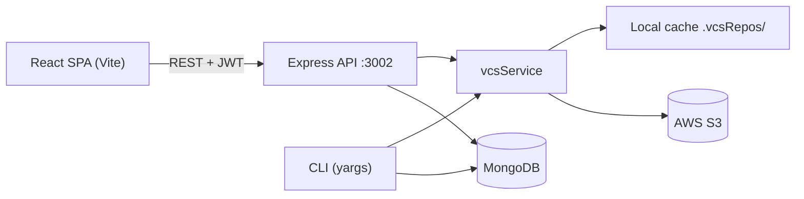

# Version Control System

A Git-inspired version control platform with a **React web app**, a **Node.js / Express API** and a **command-line interface**. Repository metadata lives in **MongoDB**, and every commit snapshot is stored in **AWS S3**, so the web UI and the CLI always work on the same remote history.

> Full technical reference: [DOCUMENTATION.md](./DOCUMENTATION.md)

---

## Features

- **Accounts** – sign up / log in with JWT authentication (bcrypt-hashed passwords), profile page, follow users, star repositories, delete account.
- **Repositories** – create public or private repositories, edit the description, toggle visibility, delete (cascades to issues, stars and S3 data), search.
- **Version control** – `stage → commit → push → pull → revert`. Commits are UUID-identified snapshots with parent links, ahead/behind status and push-divergence protection.
- **Browser workspace** – file tree and code editor with line numbers, commit history, and a per-commit file viewer.
- **README rendering** – a repository's `README.md` is rendered on its page from the latest commit.
- **Issues** – create, edit, open/close and delete issues per repository.
- **Dashboard** – repository and user search, suggested repositories, personal statistics.
- **CLI** – `login`, `init`, `add`, `commit`, `push`, `pull`, `revert`, operating on the same repositories as the web app.
- **Access control** – only the owner can modify a repository; private repositories are visible only to their owner.

## Tech stack

| Layer     | Technology                                                                 |
| --------- | -------------------------------------------------------------------------- |
| Frontend  | React 19, Vite 8, React Router 7, Axios, Primer React, `@uiw/react-heat-map` |
| Backend   | Node.js (CommonJS), Express 5, Mongoose 9, Socket.IO 4, Yargs 18           |
| Auth      | JSON Web Tokens (`jsonwebtoken`), `bcryptjs`                               |
| Storage   | MongoDB (users, repositories, issues) · AWS S3 (commit snapshots)          |
| Tooling   | oxlint                                                                     |

## How it works



1. **Stage** – files are written to a local staging area.
2. **Commit** – the staged files become an immutable snapshot (`commit.json` + files) with a UUID and a parent pointer.
3. **Push** – missing commits are uploaded to `s3://<bucket>/repositories/<repoId>/commits/<commitId>/`, then `HEAD` and `metadata.json` are updated.
4. **Pull** – missing remote commits are downloaded and the workspace is rebuilt from the remote `HEAD`.
5. **Revert** – creates a **new** commit that restores the chosen commit's snapshot (history is never rewritten).

## Project structure

```text
Version Control System/
├── backend/
│   ├── index.js              # Entry point: Express server + CLI (yargs)
│   ├── config/aws-config.js  # S3 client and bucket name
│   ├── controllers/          # REST handlers + CLI command handlers
│   ├── middleware/           # JWT auth and ownership/visibility checks
│   ├── models/               # Mongoose models: User, Repository, Issue
│   ├── routes/               # Express routers
│   ├── services/             # authService, vcsService (the VCS engine)
│   ├── utils/                # CLI session and database helpers
│   └── scripts/              # Maintenance scripts (legacy S3 cleanup)
├── frontend/
│   └── src/
│       ├── api/apiClient.js  # Axios instance with JWT interceptor
│       ├── components/       # auth, dashboard, repo, issue, user, common
│       ├── authContext.jsx   # Auth state
│       └── Routes.jsx        # Route table
├── TEST_CHECKLIST.md         # Manual production test checklist
└── README.md
```

## Getting started

### Prerequisites

- **Node.js** `20.19+` or `22.12+` (required by the Vite and Mongoose versions used)
- A **MongoDB** database (MongoDB Atlas or local)
- An **AWS S3 bucket** and an IAM user with access to it (see [DOCUMENTATION.md](./DOCUMENTATION.md#133-s3-iam-policy))

### 1. Clone and install

```bash
git clone <your-repo-url>
cd <project-folder>

cd backend && npm install
cd ../frontend && npm install
```

### 2. Configure the backend

Create `backend/.env`:

```env
PORT=3002
MONGODB_URI=mongodb+srv://<user>:<password>@<cluster>/<database>
JWT_SECRET_KEY=<a-long-random-string>
CLIENT_URL=http://localhost:5173

AWS_ACCESS_KEY_ID=<your-access-key-id>
AWS_SECRET_ACCESS_KEY=<your-secret-access-key>
AWS_REGION=ap-south-1
```

### 3. Configure the frontend (optional)

Create `frontend/.env` only if your API is not on `http://localhost:3002`:

```env
VITE_API_URL=http://localhost:3002
```

### 4. Run

```bash
# Terminal 1 – API
cd backend
npm start            # runs: node index.js start

# Terminal 2 – web app
cd frontend
npm run dev          # http://localhost:5173
```

Open <http://localhost:5173>, sign up, create a repository, then open **Code → Version Control** to add files, stage, commit and push.

## Command-line interface

The CLI is part of the backend entry point. Run it from the directory you want to work in:

```bash
cd backend

node index.js login                    # prompts for email and password
node index.js whoami                   # show the logged-in user and selected repository
node index.js init my-repo             # select one of YOUR repositories by name
node index.js add notes.txt            # stage a file (use "add ." for the whole directory)
node index.js commit "Add notes"       # snapshot the staged files
node index.js push                     # upload commits to S3
node index.js pull                     # download the remote HEAD into the workspace
node index.js revert <commitId>        # new commit restoring that commit's snapshot
node index.js logout
```

The repository must already exist (create it in the web app first). The CLI talks to MongoDB and S3 directly, so the machine running it needs the backend `.env`.

## Scripts

| Location    | Command                                            | Purpose                           |
| ----------- | -------------------------------------------------- | --------------------------------- |
| `backend/`  | `npm start`                                        | Start the API server              |
| `backend/`  | `node scripts/cleanupLegacyVcsS3.js [--dry-run]`   | Remove legacy `commits/` S3 data  |
| `frontend/` | `npm run dev`                                      | Vite dev server                   |
| `frontend/` | `npm run build`                                    | Production build to `dist/`       |
| `frontend/` | `npm run lint`                                     | Lint with oxlint                  |
| `frontend/` | `npm run preview`                                  | Preview the production build      |

## Testing

There is no automated test suite yet. Use the manual [TEST_CHECKLIST.md](./TEST_CHECKLIST.md), which covers authentication, repositories, issues, the web and CLI workflows, S3 structure and deployment.

## Security notes

- Never commit `backend/.env`, `frontend/.env`, `.vcs/`, `.vcsRepos/` or `.initFold/` (they are already in `.gitignore`).
- If credentials were ever committed or shared, **rotate them** (AWS keys, MongoDB password, JWT secret).
- Use a long, random `JWT_SECRET_KEY` in production and restrict `CLIENT_URL` to your real frontend origin(s).

## Authors

Sumit, Arjun, Siddhant, Neha

## License

ISC (as declared in `backend/package.json`)
